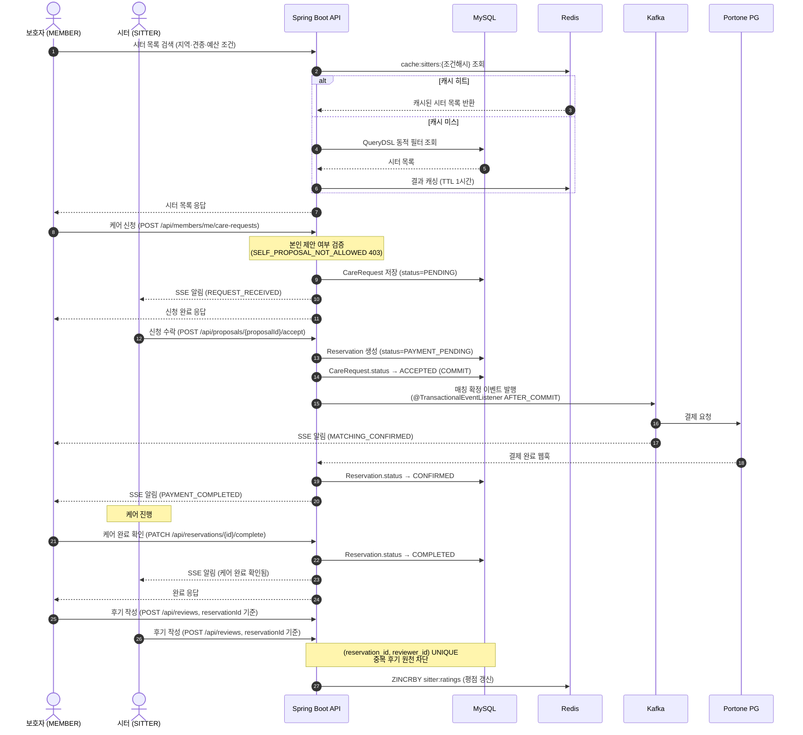
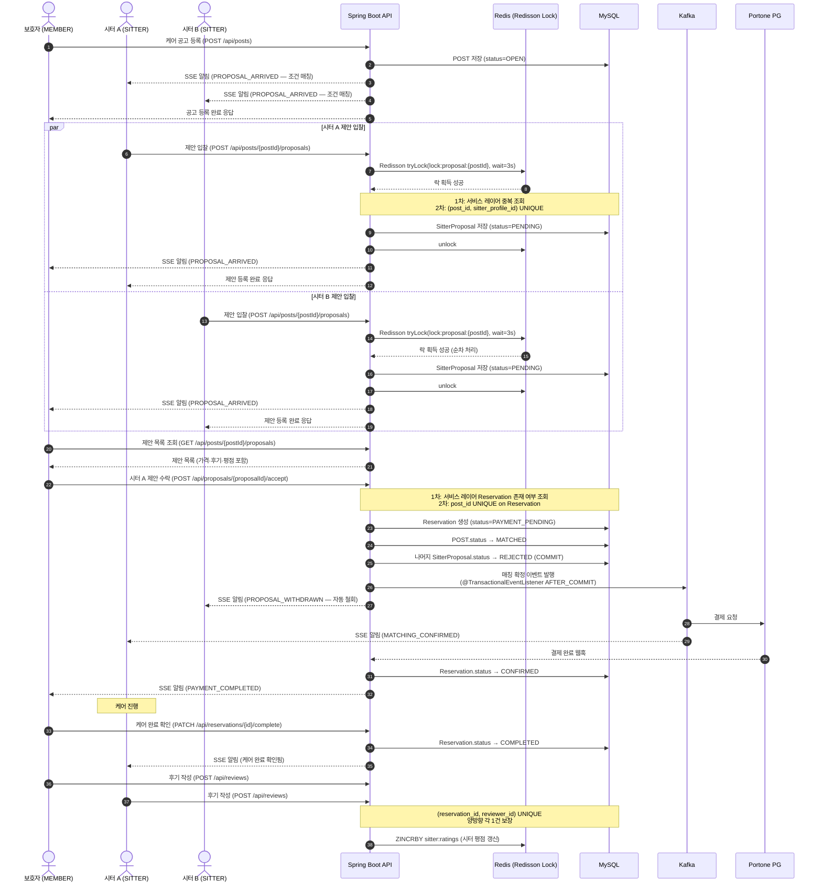
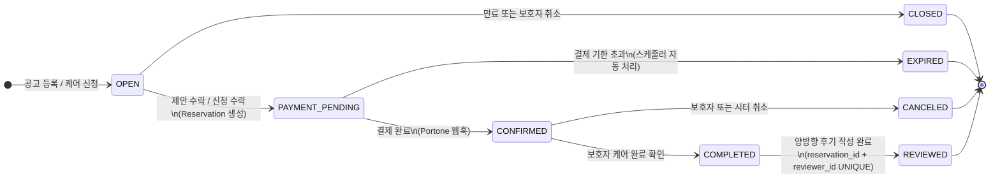

# 📋 프로젝트 개요서

> **프로젝트명:** ForPets (포펫츠)
> **팀명:** 집사조
> **문서 버전:** v1.2
> **최종 수정일:** 2026-05-13
> **작성자:** 집사조 (팀원1 · 팀원2 · 팀원3 · 팀원4 · 팀원5)

---

## 📑 목차

- [1. 프로젝트 정보](#1-프로젝트-정보)
- [2. 프로젝트 배경 및 목적](#2-프로젝트-배경-및-목적)
- [3. 서비스 개요](#3-서비스-개요)
- [4. 핵심 비즈니스 로직](#4-핵심-비즈니스-로직)
    - [4-1. 순방향 매칭 플로우](#4-1-순방향-매칭-플로우)
    - [4-2. 역방향 매칭 플로우](#4-2-역방향-매칭-플로우)
    - [4-3. 예약(Reservation) 상태 머신](#4-3-예약reservation-상태-머신)
    - [4-4. 동시성 제어 전략](#4-4-동시성-제어-전략)
- [5. 역할(MemberRole) 체계](#5-역할memberrole-체계)
- [6. SSE 이벤트 타입](#6-sse-이벤트-타입)
- [7. Redis 키 설계 원칙](#7-redis-키-설계-원칙)
- [8. 주요 기능 범위](#8-주요-기능-범위)
    - [v1 — MVP 필수 구현](#v1--mvp-필수-구현)
    - [확장 기능](#확장-기능-v1-완료-후-순차-추가)
- [9. 캐싱 전략](#9-캐싱-전략)
- [10. 기술 스택](#10-기술-스택)
    - [Backend](#backend)
    - [Database](#database)
    - [Infra](#infra)
- [11. 팀 구성 및 역할 분담](#11-팀-구성-및-역할-분담)
- [12. 프로젝트 일정](#12-프로젝트-일정)
- [13. 성공 기준](#13-성공-기준)
- [14. 주요 변경 이력](#14-주요-변경-이력)

---

## 1. 프로젝트 정보

| 항목 | 내용 |
|------|------|
| 프로젝트명 | **ForPets (포펫츠)** — 반려동물 케어 매칭 플랫폼 |
| 유형 | 커머스 백엔드 (B2C) |
| 기간 | v1 개발 완료 목표 ~2026-06-22 |
| 팀 구성 | 백엔드 개발자 5명 (집사조) |
| 기술 스택 | Java 21, Spring Boot 3.x, Spring Data JPA, QueryDSL, MySQL 8, Redis, Kafka, Docker, AWS, S3 |

---

## 2. 프로젝트 배경 및 목적

### 배경

국내 반려동물 양육 인구는 약 **1,500만 명**에 달하며 매년 증가하고 있다.
기존 펫시터·케어 서비스(케어네이처, 펫시팅닷컴 등)는 모두 **시터 주도** 구조로, 보호자가 수십 개의 시터 프로필을 일일이 탐색해야 하는 불편함이 있다.
ForPets는 보호자가 원하는 방식으로 시터를 구할 수 있도록 **순방향 검색과 역방향 매칭을 모두 지원**한다.

### 목적

- **양방향 매칭 구조 제공**: 보호자가 시터를 직접 검색·신청하는 순방향, 공고를 올리면 시터가 역으로 제안하는 역방향 모두 지원
- **실배포 경험**: 실제 사용 가능한 수준의 서비스를 AWS 환경에 배포하고 운영
- **AI 기능 통합 경험**: LLM 구조화 출력, Tool Calling, RAG, 장애 격리 등 AI Engineering 역량 습득 (확장)
- **동시성 제어 경험**: 매칭 확정 등 실제 트래픽 환경의 동시성 문제 직접 해결

---

## 3. 서비스 개요

**ForPets(포펫츠)**는 반려동물 보호자와 펫시터를 연결하는 케어 매칭 플랫폼이다.
보호자는 **시터를 직접 검색해서 신청(순방향)** 하거나, **케어 조건을 공고로 올려 시터의 제안을 받는(역방향)** 두 가지 방식 중 원하는 방식을 선택할 수 있다.

### 핵심 가치 제안

| 가치 | 설명 |
|------|------|
| 순방향 매칭 | 보호자가 조건(지역·견종·예산 등)으로 시터를 직접 검색하고 케어를 신청 |
| 역방향 매칭 | 보호자가 케어 공고 등록 → 시터가 역으로 제안 입찰 → 보호자 선택. 기존 서비스에 없는 구조 |
| 실시간 알림 | SSE 기반으로 제안 도착·매칭 확정·결제 완료 등을 보호자·시터에게 실시간 푸시 |
| AI 시맨틱 탐색 | "분리불안 있는 노령견 경험 있는 시터" 등 자연어로 시터를 탐색하는 RAG 기반 검색 (확장) |

---

## 4. 핵심 비즈니스 로직

### 4-1. 순방향 매칭 플로우

> 보호자가 시터를 직접 탐색하고 케어를 신청하는 방식.



```
1. 보호자(MEMBER) → 조건(지역, 견종 크기, 예산 등)으로 시터 목록 검색 (QueryDSL 동적 필터)
2. 보호자(MEMBER) → 원하는 시터 프로필 확인 후 케어 신청
                    └ 본인 공고에 본인이 시터로 제안 불가 (SELF_PROPOSAL_NOT_ALLOWED)
3. 시터(SITTER)   → 신청 수락 or 거절
4. 수락 시 → Reservation 생성 (status=PAYMENT_PENDING)
           → Kafka @TransactionalEventListener(AFTER_COMMIT) 으로 결제·알림 이벤트 발행
5. 결제 완료 → Reservation.status = CONFIRMED → 케어 진행
6. 보호자(MEMBER) → 케어 완료 확인 (Reservation.status → COMPLETED)
7. 보호자·시터 → 양방향 후기 작성 가능 (reservationId 기준)
```

### 4-2. 역방향 매칭 플로우

> 보호자가 조건을 공고로 올리면 시터가 역으로 제안하는 방식.



```
1. 보호자(MEMBER) → 케어 공고 등록 (날짜, 견종, 예산, 요구사항) (POST.status = OPEN)
2. 시스템 → 조건 맞는 시터에게 SSE 알림 발송 (PROPOSAL_ARRIVED)
3. 시터(SITTER)들 → 제안 입찰 (proposed_price, message)
                    └ 본인 공고에 본인 제안 불가 (SELF_PROPOSAL_NOT_ALLOWED)
                    └ DB Unique (post_id + sitter_profile_id) — 중복 제안 원천 차단
                    └ 서비스 레이어에서 중복 여부 선제 검증 → UNIQUE 충돌 도달 최소화
4. 보호자(MEMBER) → 제안 목록 비교 후 최적 시터 1명 선택
5. 시스템 → 매칭 확정
           └ Reservation 생성 (status=PAYMENT_PENDING)
           └ DB Unique (post_id UNIQUE on Reservation) — 중복 확정 원천 차단
           └ 서비스 레이어에서 중복 여부 선제 검증 → UNIQUE 충돌 도달 최소화
           └ Kafka @TransactionalEventListener(AFTER_COMMIT) → 결제·알림·일정 생성 이벤트 발행
6. 결제 완료 → Reservation.status = CONFIRMED → 케어 진행
7. 보호자(MEMBER) → 케어 완료 확인 (Reservation.status → COMPLETED)
8. 보호자·시터 → 양방향 후기 작성 가능 (reservationId 기준)
```

### 4-3. 예약(Reservation) 상태 머신



```
                  ┌──────────────────────────────────────────────────────┐
[OPEN] ─수락─▶ [PAYMENT_PENDING] ─결제완료─▶ [CONFIRMED] ─완료확인─▶ [COMPLETED]
  │                   │                           │                      │
만료/                만료                        취소                 양방향 후기
취소                  │                           │                      ▼
  ▼                   ▼                           ▼                [REVIEWED]
[CLOSED]          [EXPIRED]                  [CANCELED]
```

| 상태 | 설명 | 전이 가능 상태 |
|------|------|---------------|
| `OPEN` | 공고 등록 완료 또는 케어 신청 대기. 제안·수락 가능 | → PAYMENT_PENDING, CLOSED |
| `PAYMENT_PENDING` | 매칭 확정, 결제 대기 중 | → CONFIRMED, EXPIRED |
| `CONFIRMED` | 결제 완료, 케어 예약 확정 | → COMPLETED, CANCELED |
| `COMPLETED` | 보호자가 케어 완료 확인. 양방향 후기 작성 가능 | → REVIEWED |
| `REVIEWED` | 양방향 후기 작성 완료 | — (종료) |
| `CLOSED` | 기간 만료 또는 보호자 취소 (PAYMENT_PENDING 이전) | — (종료) |
| `EXPIRED` | 결제 기한 초과 자동 만료 (스케줄러 처리) | — (종료) |
| `CANCELED` | CONFIRMED 상태에서 보호자 또는 시터 취소 | — (종료) |

> **양방향 후기 기준:** Reservation 상태가 `COMPLETED`로 전환된 시점부터 보호자와 시터 모두 후기를 작성할 수 있다.
> 후기 중복 방지는 `(reservation_id, reviewer_id) UNIQUE` 제약으로 보장한다.

### 4-4. 동시성 제어 전략

> v1에서는 서비스 레이어의 선제 검증(중복 체크)을 1차 방어선으로 하고, DB Unique 제약을 최종 방어선으로 둔다.
> Redisson 분산 락은 v1에서도 시터 제안 입찰 시나리오에 도입한다.
> Kafka 이벤트는 `@TransactionalEventListener(phase = AFTER_COMMIT)`으로 DB 커밋 이후에만 발행하여 롤백 시 이벤트가 발행되지 않도록 보장한다.

| 시나리오 | 1차 방어 (서비스 레이어) | 2차 방어 (DB) | 실패 응답 | 시기 |
|----------|------------------------|--------------|---------|------|
| 시터 중복 제안 방지 | 서비스에서 중복 여부 조회 후 즉시 409 | `(post_id, sitter_profile_id) UNIQUE` | `PROPOSAL_DUPLICATED` 409 | v1 |
| 매칭 중복 확정 방지 | 서비스에서 Reservation 존재 여부 조회 | `post_id UNIQUE on Reservation` | `POST_ALREADY_MATCHED` 409 | v1 |
| 본인 공고 제안 차단 | 서비스에서 작성자 ID 비교 | — | `SELF_PROPOSAL_NOT_ALLOWED` 403 | v1 |
| 시터 제안 동시 입찰 정합성 강화 | Redisson 분산 락 (waitTime 3s, leaseTime 10s) | `(post_id, sitter_profile_id) UNIQUE` | `PROPOSAL_LOCK_FAILED` 429 | v1 |
| 후기 중복 방지 | 서비스에서 중복 여부 조회 후 즉시 409 | `(reservation_id, reviewer_id) UNIQUE` | `REVIEW_DUPLICATED` 409 | v1 |

> **Kafka 이벤트 발행 보장 원칙:**
> `@Transactional` 메서드 내에서 직접 Kafka Producer를 호출하면, DB COMMIT 전에 발행될 수 있어 롤백 시 이벤트가 유실되거나 불일치가 발생한다.
> 반드시 `@TransactionalEventListener(phase = TransactionPhase.AFTER_COMMIT)`을 사용하여 COMMIT 이후에만 발행한다.

---

## 5. 역할(MemberRole) 체계

> 모든 인증·인가 로직, ERD, JWT payload, @PreAuthorize 어노테이션은 아래 역할값을 기준으로 통일한다.

| 역할 | 값 | 주요 권한 |
|------|-----|---------|
| 일반 회원 | `MEMBER` | 반려동물 등록 (선택), 시터 검색·신청, 케어 공고 등록, 결제 가능 |
| 시터 | `SITTER` | MEMBER의 모든 권한 + 시터 프로필 관리, 제안 입찰, 케어 일지 등록 (확장) |
| 관리자 | `ADMIN` | 관리자 기능 |

> **역할 전환:** 회원가입 시 역할을 선택하며, MEMBER → SITTER 전환은 시터 프로필 등록 완료 시점에 가능하다.
> MEMBER는 반려동물 등록 없이도 시터 검색·신청이 가능하다. 단, 케어 신청 시 반려동물 정보가 필요하므로 신청 전 등록을 안내한다.

---

## 6. SSE 이벤트 타입

> 모든 SSE 이벤트는 아래 타입으로 통일한다. API 명세서·기능명세서·ADR이 이 표를 기준으로 동기화한다.

| 타입 | 발생 시점 |
|------|---------|
| `PROPOSAL_ARRIVED` | 공고에 새 제안 도착 시 |
| `MATCHING_CONFIRMED` | 매칭 확정 시 |
| `REQUEST_RECEIVED` | 보호자가 직접 케어 신청 시 (순방향) |
| `PROPOSAL_WITHDRAWN` | 수락으로 인해 타 제안 자동 철회 시 |
| `PAYMENT_COMPLETED` | 결제 완료 시 |

---

## 7. Redis 키 설계 원칙

> 키 네이밍은 아래 패턴으로 전 문서 통일한다.

| 용도 | 키 패턴 | TTL |
|------|--------|-----|
| JWT 블랙리스트 | `jwt:blacklist:{token}` | 토큰 잔여 만료시간 |
| 인기 시터 Top 10 | `cache:sitter:top10` | 1시간 |
| 시터 목록 | `cache:sitters:{조건해시}` | 1시간 |
| 포스팅 목록 | `cache:postings:{조건해시}` | 5분 |
| 시터 프로필 | `cache:sitter:{userId}` | 1시간 |
| 보호자·반려동물 프로필 | `cache:profile:{userId}` | 1시간 |
| 시터 평점 랭킹 (ZSET) | `sitter:ratings` | 실시간 (TTL 없음) |
| 분산 락 — 제안 입찰 | `lock:proposal:{postId}` | leaseTime 10s |

---

## 8. 주요 기능 범위

### v1 — MVP 필수 구현

| 기능 | 설명 |
|------|------|
| 회원 관리 | 회원가입 (MEMBER / SITTER / ADMIN 역할 구분), 로그인·로그아웃 (JWT + `jwt:blacklist:{token}`), 프로필 관리 |
| 시터 등록·조회 | 시터 프로필 등록, 조건 기반 동적 검색 (QueryDSL) |
| 반려동물 등록 | 견종, 나이, 체중, 특이사항 등 반려동물 프로필 관리 (선택 사항) |
| 케어 공고 등록·조회 | MEMBER가 케어 조건 공고 등록 (POST.status = OPEN), QueryDSL 동적 필터 검색 |
| 순방향 매칭 | MEMBER → 시터 직접 검색·신청 (`POST /api/members/me/care-requests`) → 시터 수락/거절 → Reservation 생성 |
| 역방향 매칭 | MEMBER 공고 등록 → SITTER 제안 입찰 (`POST /api/proposals/{proposalId}/accept`) → MEMBER 최적 시터 1명 선택 → Reservation 생성 |
| 결제 | Portone 결제 연동. Kafka `@TransactionalEventListener(AFTER_COMMIT)` 기반 비동기 처리 |
| 후기·평점 | Reservation COMPLETED 후 보호자·시터 양방향 후기 작성 가능. `reservationId` 기준. Redis ZSET 시터 평점 랭킹 캐싱 |
| 알림 | SSE 기반 실시간 알림 (5가지 이벤트 타입 §6 참고) |
| 동시성 제어 | Redisson 분산 락 (제안 입찰) + DB Unique 제약 (최종 방어) + 서비스 레이어 선제 검증 |
| CI/CD | GitHub Actions — main 브랜치 push 시 테스트 → 빌드 → ECR push → EC2 자동 배포 |
| 모니터링 | Spring Actuator + Prometheus + Grafana |

### 확장 기능 (v1 완료 후 순차 추가)

| 기능 | 설명 |
|------|------|
| 실시간 케어 일지 | 시터가 케어 일지/사진 등록 → SSE로 보호자 실시간 푸시 |
| AI 시터 프로필 자동 생성 | LLM 구조화 출력으로 시터 프로필 문구 자동 생성 (카테고리별 프롬프트 분기) |
| AI 시터 추천 챗봇 | Tool Calling 기반 자연어 시터 검색 ("말티즈 맡길 시터 찾아줘") |
| AI 장애 격리 | Fallback 2가지 + Circuit Breaker + 환각 방어 |
| RAG 시맨틱 검색 | 시터 후기·프로필 벡터 임베딩 → 자연어 시맨틱 탐색 |
| 멀티턴 챗봇 + SSE 스트리밍 | 대화 맥락 유지 + Redis 세션 관리 + 실시간 스트리밍 |
| 단기 렌탈 | 용품 등록, 렌탈 신청, 반납 지연 자동 패널티 (스케줄러) |
| 임시보호 매칭 | 구조단체 공고 등록, 임시보호자 지원·매칭 |
| 1:1 채팅 | WebSocket STOMP 기반 보호자-시터 채팅 |
| 소셜 로그인 | OAuth2 검토 |

---

## 9. 캐싱 전략

| 캐시 대상 | 저장소 | TTL | 이유 |
|-----------|--------|-----|------|
| 인기 시터 Top 10 | Redis | 1시간 | 조회 빈도 높고 자주 변경되지 않음 |
| 시터 평점 랭킹 (Redis ZSET) | Redis | 실시간 | ZINCRBY 자동 관리, TTL 없음 |
| 포스팅 목록 | Redis | 5분 | 조회 빈번, 잦은 변경 없음 |
| 시터 목록 | Redis | 1시간 | 시터 정보 변경 빈도 낮음 |
| 보호자·시터·반려동물 프로필 | Redis | 1시간 | 해당 정보가 자주 변경될 상황이 발생하지 않을 것으로 판단 |
| AI 프로필 생성 결과 | Redis | 1시간 | LLM 비용 절감, 동일 요청 재사용 (확장) |

---

## 10. 기술 스택

### Backend

| 분류 | 기술 | 단계 | 선택 이유 |
|------|------|------|-----------|
| 언어/프레임워크 | Java 21 + Spring Boot 3.x | v1 필수 | Virtual Thread 지원, 팀 공통 학습 스택 |
| ORM | Spring Data JPA + QueryDSL | v1 필수 | 동적 검색 쿼리(시터·공고 필터), 타입 안전, N+1 해결 |
| 인증 | Spring Security + JWT | v1 필수 | Stateless 인증, MEMBER/SITTER/ADMIN 역할 분리. 로그아웃은 `jwt:blacklist:{token}` Redis 블랙리스트로 처리 |
| 결제 | Portone | v1 필수 | 국내 표준 PG 연동, 웹훅 처리 간편 |
| 메시징 | Kafka | v1 필수 | 매칭 확정 → 결제·알림 비동기 파이프라인. `@TransactionalEventListener(AFTER_COMMIT)`으로 커밋 이후 발행 보장 |
| 실시간 | SSE | v1 필수 | 알림 단방향 푸시. WebSocket 대비 연결 비용 낮고 HTTP 기반이라 방화벽 이슈 없음 |
| 분산 락 | Redisson | v1 필수 | 시터 제안 동시 입찰 정합성. DB Unique와 이중 방어 |
| 파일 저장 | AWS S3 | v1 필수 | 시터 프로필 이미지 저장·서빙 분리 |
| 실시간 채팅 | WebSocket STOMP | 확장 | 보호자-시터 1:1 채팅. 양방향 통신 필요 |
| AI | Spring AI + Claude/OpenAI | 확장 | LLM 통합, Tool Calling, RAG 파이프라인 구성 |

### Database

| 분류 | 기술 | 선택 이유 |
|------|------|-----------|
| RDBMS | MySQL 8 | 트랜잭션 보장, InnoDB 락 지원 |
| 캐시 스토어 | Redis 7 | 캐싱, SSE 세션, Pub/Sub, 시터 평점 ZSET, JWT 블랙리스트 |
| 벡터 DB | Pinecone 또는 pgvector | RAG 시맨틱 검색용 (확장) |
| **서버 타임존** | **KST (UTC+9)** | **모든 datetime 저장·반환 기준** |

### Infra

| 분류 | 기술 | 선택 이유 |
|------|------|-----------|
| 컨테이너 | Docker + Docker Compose | 로컬 개발 환경 일관성, 팀원 간 환경 차이 최소화 |
| 클라우드 | AWS EC2 · RDS · ElastiCache | 팀 공통 학습 스택, 실배포 경험 |
| 파일 저장 | AWS S3 | 이미지 저장·서빙을 앱 서버와 분리 |
| CI/CD | GitHub Actions | main 브랜치 push 시 테스트 → 빌드 → ECR push → EC2 자동 배포 (v1 필수) |
| 모니터링 | Spring Actuator + Prometheus + Grafana | API 응답 시간·에러율 실시간 가시화 |
| 부하 테스트 | k6 | 스크립트 기반 간편한 부하 시나리오 작성 |

---

## 11. 팀 구성 및 역할 분담

| 팀원 | 담당 도메인 | 주요 책임 |
|------|------------|-----------|
| 팀원 1 | **회원·인증 (Auth/User)** | 회원가입/로그인/로그아웃 (JWT + 블랙리스트), 프로필, AI 시터 프로필 자동 생성 (확장) |
| 팀원 2 | **공고·검색 (Posting/Search)** | 케어 공고 CRUD, QueryDSL 동적 검색, 시터 목록 조회, 후기·평점, RAG 시맨틱 검색 (확장) |
| 팀원 3 | **매칭·동시성 (Matching)** | 순방향·역방향 매칭, Redisson 분산 락, Kafka 매칭 이벤트, AI Tool Calling (확장) |
| 팀원 4 | **렌탈·임시보호 (Rental/TempCare)** | 단기 렌탈 (확장), 임시보호 매칭 (확장), AI 장애 격리 (확장) |
| 팀원 5 | **알림·인프라 (Notification/Infra)** | SSE 알림, CI/CD, Docker Compose, Grafana, WebSocket 채팅 (확장), AI 멀티턴 챗봇 (확장) |

> **⚠️ 인프라 블로커 리스크 완화 방침**
>
> - **Day 1~2:** 팀원 5는 Docker Compose 로컬 개발 환경 (MySQL, Redis, Kafka, App) 최우선 완성
> - **Day 3 마감 (Critical Milestone):** Docker Compose 전 팀원 검증 완료 — 지연 시 팀 전체 일정 지연

---

## 12. 프로젝트 일정

```
■ v1 개발 (~2026-06-22 목표)

  1주차 (설계·환경)
    Day 1~2 : SA 문서 작성, ERD 확정, API 명세 작성
               팀원 5: Docker Compose 로컬 환경 (MySQL + Redis + Kafka + App) ← 최우선
    Day 3   : 튜터 피드백, Docker Compose 전 팀원 검증 ← Critical Milestone
    Day 4~7 : 회원·공고·시터 기본 CRUD 구현

  2주차 (핵심 기능)
    Day 8~10 : 순방향·역방향 매칭 플로우, Reservation 생성
                동시성 테스트 코드 작성 (실패 확인) → Redisson 분산 락 + DB Unique 적용 → 통과
    Day 11~14: SSE 알림, Kafka @TransactionalEventListener(AFTER_COMMIT), Portone 결제

  3주차 (성능·운영)
    Day 15~17: 부하 테스트 (k6), Redis 캐싱, 쿼리 최적화, Grafana 모니터링
                AWS 인프라 구성, CI/CD 파이프라인 완성

─────────────────────────────────────────────────────────

■ 확장 기능 (v1 완료 후 순차 추가)

  AI 기능: LLM 구조화 출력, Tool Calling, AI 장애 격리 (필수)
            RAG 파이프라인, 멀티턴 챗봇 + SSE 스트리밍 (도전)

  부가 기능: 실시간 케어 일지, 단기 렌탈, 임시보호 매칭, 1:1 채팅
```

---

## 13. 성공 기준

| 기준 | 목표치 | 시기 |
|------|--------|------|
| 매칭 중복 확정 방지 | Redisson 락 + DB Unique로 중복 매칭 0건 | v1 |
| 동시성 테스트 통과 | 100 Thread 동시 요청 시 중복 매칭 0건 | v1 |
| Kafka 이벤트 정합성 | DB 롤백 시 Kafka 이벤트 미발행 (AFTER_COMMIT 보장) | v1 |
| 캐시 성능 개선 | 캐시 미적용 대비 응답 시간 50% 이상 단축 | v1 |
| 필수 기능 완성률 | 100% | v1 |
| 배포 자동화 | main 브랜치 Push → 5분 내 EC2 자동 반영 | v1 |
| AI 기능 완성률 | 필수 3가지 100% + 도전 2가지 80% 이상 | 확장 |
| 중간 발표 | 2026-05-29 — SA 문서 + MVP 배포 완료 | |
| 최종 발표 | 2026-06-23 | |

---

## 14. 주요 변경 이력

| 버전 | 변경 내용 | 사유 |
|------|-----------|------|
| v1.0 | 최초 작성 | 포펫츠 프로젝트 시작 |
| v1.1 | 회의 후 수정 사항 반영 | 팀원 검토 결과 반영 |
| v1.2 | 팀 회의 결정사항 14가지 전체 반영 | 문서 간 정합성 문제 해결 |