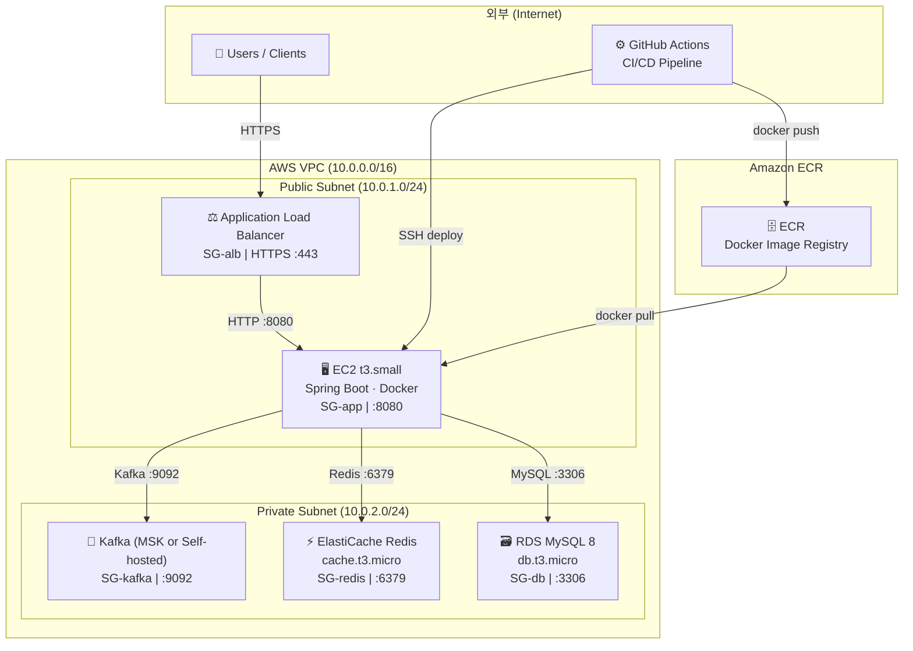

# 🏗️ 인프라 아키텍처 다이어그램

> **프로젝트명:** ForPets (포펫츠)
> **팀명:** 집사조
> **문서 버전:** v1.0
> **최종 수정일:** 2026-05-12
> **연결 문서:** 01_프로젝트_개요서, 04_기능_명세서

---

## 1. 아키텍처 다이어그램



---

> **⚠️ 환경별 인스턴스 구분:**
> 다이어그램은 **실서비스 최소 구성(t3.small)** 기준으로 작성됐습니다.
> AWS 프리티어 무료 개발·테스트 환경에서는 **t2.micro(EC2), db.t2.micro(RDS), cache.t2.micro(ElastiCache)** 를 사용합니다.
> EC2가 Public Subnet에 배치된 이유: ALB에서 인바운드를 받아야 하므로 인터넷 게이트웨이 접근이 필요합니다. DB/Redis/Kafka는 Private Subnet에 격리하여 외부 직접 접근을 차단합니다.
>
> **Kafka 선택 옵션:**
> - **Self-hosted (Docker Compose):** 로컬 및 초기 개발 환경. EC2 위에 직접 설치 가능.
> - **Amazon MSK:** 관리형 Kafka. 운영 안정성 높지만 비용 발생.
> - 초기엔 Self-hosted로 시작하고 운영 안정화 후 MSK 전환을 고려한다.

---

## 2. 컴포넌트별 역할

| 컴포넌트 | 인스턴스 타입 | 역할 한 줄 설명 |
|----------|--------------|----------------|
| **EC2** | t3.small | Spring Boot 앱 서버 — 케어 공고, 시터 매칭, 렌탈, AI 기능 등 모든 비즈니스 로직 실행 |
| **RDS MySQL 8** | db.t3.micro | CARE_POSTING, SITTER_PROPOSAL, MATCHING, RENTAL 등 모든 영속 데이터의 Source of Truth |
| **ElastiCache Redis** | cache.t3.micro | Redisson 분산락 (제안 입찰·렌탈 재고), 캐싱, SSE 세션, 시터 평점 ZSET, AI 챗봇 세션 |
| **Kafka** | Self-hosted / MSK | 매칭 확정 이벤트 비동기 처리 (결제·알림·일정 생성 독립 소비) |
| **ECR** | — | GitHub Actions가 빌드한 Docker 이미지를 저장하고 EC2가 pull하는 레지스트리 |
| **ALB** | — | 외부 HTTPS 트래픽을 EC2로 라우팅, SSL 종료 (ACM 인증서 연결) |
| **GitHub Actions** | — | main 브랜치 push 시 테스트 → 빌드 → ECR push → EC2 배포 자동화 |

---

## 3. VPC / 보안 그룹 구성

### 3-1. 서브넷 구성

| 서브넷 | CIDR | 배치 컴포넌트 | 인터넷 게이트웨이 |
|--------|------|--------------|-----------------|
| Public Subnet | 10.0.1.0/24 | ALB, EC2 | ✅ 연결됨 |
| Private Subnet | 10.0.2.0/24 | RDS, ElastiCache, Kafka | ❌ 차단 |

> **설계 원칙:** RDS, ElastiCache, Kafka는 Private Subnet에 격리하여 외부에서 직접 접근 불가.
> EC2만 두 서브넷에 걸쳐 통신할 수 있는 중간 계층 역할.

### 3-2. 보안 그룹 규칙

| 보안 그룹 | 인바운드 허용 | 아웃바운드 | 역할 |
|-----------|-------------|-----------|------|
| **SG-alb** | `0.0.0.0/0 → 443 (HTTPS)` | EC2:8080 | 외부 사용자 HTTPS 트래픽 수신 |
| **SG-app** | `SG-alb → 8080` / `GitHub Actions IP → 22 (SSH)` | RDS:3306, Redis:6379, Kafka:9092 | ALB에서만 앱 접근 |
| **SG-db** | `SG-app → 3306` | — | EC2만 DB 접근, 외부 완전 차단 |
| **SG-redis** | `SG-app → 6379` | — | EC2만 Redis 접근, 외부 완전 차단 |
| **SG-kafka** | `SG-app → 9092` | — | EC2만 Kafka 접근, 외부 완전 차단 |

### 3-3. 보안 강화 로드맵

```
[현재 MVP]
  EC2 SSH → GitHub Actions IP 직접 허용 (22번 포트)

[추후 강화]
  Bastion Host 도입 → EC2 SSH 포트 완전 차단
  또는 AWS SSM Session Manager 사용 (SSH 없이 접근)
```

---

## 4. 예상 월 비용

### 4-1. AWS 프리티어 (12개월 이내)

| 항목 | 스펙 | 비용 | 비고 |
|------|------|------|------|
| EC2 | t2.micro (750h/월) | **무료** | 프리티어 한도 내 |
| RDS | db.t2.micro (750h/월) | **무료** | 단일 AZ, 20GB SSD |
| ElastiCache | cache.t2.micro (750h/월) | **무료** | 단일 노드 |
| ECR | 500MB/월 | **무료** | 이미지 용량 관리 필요 |
| Kafka | EC2 위 Self-hosted | **무료** | EC2 프리티어 포함 (단, EC2 1대로 제한) |
| ALB | LCU 기반 | **~$18** | 프리티어 제외 항목 |
| 데이터 전송 | 15GB/월 | **무료** | 초과 시 $0.09/GB |
| **합계** | | **~$18/월** | ALB만 유료 |

> 💡 **프리티어 절약 팁:** ALB 대신 EC2 Public IP에 직접 붙이면 거의 $0. 단, HTTPS 미적용 상태이므로 개발·테스트 환경 전용으로만 권장.

### 4-2. 실서비스 최소 구성

| 항목 | 스펙 | 비용 | 비고 |
|------|------|------|------|
| EC2 | t3.small | **~$15/월** | 2 vCPU, 2GB RAM |
| RDS | db.t3.micro (Single-AZ) | **~$28/월** | 비용 절감 시 Single-AZ |
| ElastiCache | cache.t3.micro | **~$13/월** | 단일 노드 |
| Kafka | EC2 t3.micro Self-hosted | **~$8/월** | 별도 EC2 1대 |
| ECR | ~2GB | **~$1/월** | |
| ALB | — | **~$18/월** | |
| 데이터 전송 | ~10GB | **~$5/월** | |
| **합계** | | **~$88/월** | |

---

## 5. 배포 파이프라인 흐름

### 5-1. 전체 흐름

```
main 브랜치 push
        │
        ▼
① GitHub Actions Workflow 트리거
        │
        ├─ [Test] ./gradlew test
        │    └─ 단위 테스트 + 통합 테스트 실행
        │    └─ 실패 시 → 파이프라인 중단
        │
        ├─ [Build] docker build -t forpets .
        │    └─ Dockerfile 기반 JAR 빌드 + 이미지 생성
        │
        ├─ [Push] ECR 로그인 + 이미지 push
        │    └─ docker tag forpets {ECR_URI}:$GITHUB_SHA
        │    └─ docker push {ECR_URI}:$GITHUB_SHA
        │
        └─ [Deploy] EC2 SSH 접속 + 컨테이너 교체
             └─ docker pull {ECR_URI}:$GITHUB_SHA
             └─ docker stop forpets (기존 컨테이너 종료)
             └─ docker run -d --name forpets \
                  -e DB_URL=${{ secrets.DB_URL }} \
                  -e REDIS_HOST=${{ secrets.REDIS_HOST }} \
                  -e KAFKA_BOOTSTRAP=${{ secrets.KAFKA_BOOTSTRAP }} \
                  -e JWT_SECRET=${{ secrets.JWT_SECRET }} \
                  -e AI_API_KEY=${{ secrets.AI_API_KEY }} \
                  -p 8080:8080 \
                  {ECR_URI}:$GITHUB_SHA
             └─ ALB Health Check: GET /actuator/health → 200 OK 확인 후 트래픽 전환
```

### 5-2. GitHub Actions Workflow 예시

```yaml
name: ForPets CI/CD

on:
  push:
    branches: [ main ]

env:
  AWS_REGION: ap-northeast-2
  ECR_REPOSITORY: forpets
  EC2_HOST: ${{ secrets.EC2_HOST }}

jobs:
  test:
    runs-on: ubuntu-latest
    steps:
      - uses: actions/checkout@v4
      - uses: actions/setup-java@v4
        with:
          java-version: '21'
          distribution: 'temurin'
      - name: Run Tests
        run: ./gradlew test

  build-and-deploy:
    needs: test
    runs-on: ubuntu-latest
    steps:
      - uses: actions/checkout@v4

      - name: Configure AWS credentials
        uses: aws-actions/configure-aws-credentials@v4
        with:
          aws-access-key-id: ${{ secrets.AWS_ACCESS_KEY_ID }}
          aws-secret-access-key: ${{ secrets.AWS_SECRET_ACCESS_KEY }}
          aws-region: ${{ env.AWS_REGION }}

      - name: Login to Amazon ECR
        id: login-ecr
        uses: aws-actions/amazon-ecr-login@v2

      - name: Build, tag, and push image to ECR
        env:
          ECR_REGISTRY: ${{ steps.login-ecr.outputs.registry }}
          IMAGE_TAG: ${{ github.sha }}
        run: |
          docker build -t $ECR_REGISTRY/$ECR_REPOSITORY:$IMAGE_TAG .
          docker push $ECR_REGISTRY/$ECR_REPOSITORY:$IMAGE_TAG

      - name: Deploy to EC2
        uses: appleboy/ssh-action@v1
        with:
          host: ${{ secrets.EC2_HOST }}
          username: ec2-user
          key: ${{ secrets.EC2_SSH_KEY }}
          envs: ECR_REGISTRY,ECR_REPOSITORY,IMAGE_TAG
          script: |
            aws ecr get-login-password --region ap-northeast-2 \
              | docker login --username AWS --password-stdin $ECR_REGISTRY
            docker pull $ECR_REGISTRY/$ECR_REPOSITORY:$IMAGE_TAG
            docker stop forpets || true
            docker rm forpets || true
            docker run -d --name forpets \
              -p 8080:8080 \
              -e DB_URL=$DB_URL \
              -e REDIS_HOST=$REDIS_HOST \
              -e KAFKA_BOOTSTRAP=$KAFKA_BOOTSTRAP \
              -e JWT_SECRET=$JWT_SECRET \
              -e AI_API_KEY=$AI_API_KEY \
              $ECR_REGISTRY/$ECR_REPOSITORY:$IMAGE_TAG
            # ALB Health Check 경로: GET /actuator/health
```

### 5-3. GitHub Secrets 등록 목록

| Secret 이름 | 값 | 용도 |
|-------------|---|------|
| `AWS_ACCESS_KEY_ID` | IAM 액세스 키 | ECR 로그인, 이미지 push |
| `AWS_SECRET_ACCESS_KEY` | IAM 시크릿 키 | ECR 로그인, 이미지 push |
| `EC2_HOST` | EC2 퍼블릭 IP | SSH 접속 대상 |
| `EC2_SSH_KEY` | EC2 PEM 키 내용 | SSH 인증 |
| `DB_URL` | `jdbc:mysql://{RDS_ENDPOINT}:3306/forpets` | 앱 DB 연결 |
| `REDIS_HOST` | ElastiCache 엔드포인트 | Redisson, 캐싱, SSE 세션 |
| `KAFKA_BOOTSTRAP` | Kafka 브로커 주소 | 매칭 이벤트 비동기 처리 |
| `JWT_SECRET` | JWT 서명 키 | 인증 |
| `AI_API_KEY` | Claude/OpenAI API 키 | LLM 기능 (프로필 생성, 챗봇, RAG) |

> **보안 원칙:** EC2 IAM Role에는 `ecr:GetAuthorizationToken`, `ecr:BatchGetImage` 권한만 부여 (최소 권한 원칙).

### 5-4. 롤백 전략

```bash
# 이전 이미지 SHA로 즉시 롤백
docker pull {ECR_URI}:{이전_GITHUB_SHA}
docker stop forpets
docker run -d --name forpets {ECR_URI}:{이전_GITHUB_SHA}
```

ECR에 이미지 태그가 커밋 SHA 기준으로 보관되어 있으므로, 이전 SHA를 지정하면 코드 변경 없이 즉시 롤백 가능.

---

## 6. 로컬 개발 환경 (Docker Compose)

```yaml
# docker-compose.yml
version: '3.8'

services:
  mysql:
    image: mysql:8.0
    container_name: forpets-mysql
    environment:
      MYSQL_ROOT_PASSWORD: root
      MYSQL_DATABASE: forpets
    ports:
      - "3306:3306"
    volumes:
      - mysql_data:/var/lib/mysql

  redis:
    image: redis:7.0
    container_name: forpets-redis
    ports:
      - "6379:6379"

  zookeeper:
    image: confluentinc/cp-zookeeper:7.4.0
    container_name: forpets-zookeeper
    environment:
      ZOOKEEPER_CLIENT_PORT: 2181
    ports:
      - "2181:2181"

  kafka:
    image: confluentinc/cp-kafka:7.4.0
    container_name: forpets-kafka
    depends_on:
      - zookeeper
    environment:
      KAFKA_BROKER_ID: 1
      KAFKA_ZOOKEEPER_CONNECT: zookeeper:2181
      KAFKA_ADVERTISED_LISTENERS: PLAINTEXT://localhost:9092
      KAFKA_OFFSETS_TOPIC_REPLICATION_FACTOR: 1
    ports:
      - "9092:9092"

  app:
    build: .
    container_name: forpets-app
    depends_on:
      - mysql
      - redis
      - kafka
    ports:
      - "8080:8080"
    environment:
      DB_URL: jdbc:mysql://mysql:3306/forpets
      REDIS_HOST: redis
      KAFKA_BOOTSTRAP: kafka:9092
      JWT_SECRET: local-dev-secret
      AI_API_KEY: ${AI_API_KEY}

volumes:
  mysql_data:
```

> **Day 1~2 Critical Milestone:** 최길중이 Docker Compose 환경을 완성하고 전 팀원이 검증 완료해야 이후 개발이 막힘 없이 진행됨.
> Kafka까지 포함된 로컬 환경 세팅이 TicketFlow 대비 복잡하므로 Day 1에 최우선으로 진행.

---

## 7. 모니터링 구성

```
Spring Actuator (메트릭 노출)
        │
        ▼
Prometheus (메트릭 수집 · 저장)
        │
        ▼
Grafana (대시보드 시각화)
```

### 수집 주요 메트릭

| 메트릭 | 설명 | 임계값 |
|--------|------|--------|
| API 응답 시간 P95/P99 | 95/99 퍼센타일 응답 시간 | P95 > 500ms 경보 |
| HTTP 에러율 | 4xx/5xx 비율 | 에러율 > 5% 경보 |
| Redisson 락 실패율 | 429 LOCK_FAILED 비율 | 높으면 UX 안내 강화 |
| Kafka 처리 지연 | Consumer lag | lag > 1000 경보 |
| Redis 캐시 히트율 | 캐시 히트/미스 비율 | 히트율 < 70% 점검 |
| AI 토큰 사용량 | 모델별 누적 토큰 | 비용 한도 설정 |
| AI P95 응답 지연 | LLM 응답 시간 | P95 > 5s Fallback 트리거 |
| JVM 힙 사용량 | 메모리 사용률 | 80% 이상 경보 |

---

## 8. 주요 변경 이력

| 버전 | 변경 내용 | 일자 |
|------|-----------|------|
| v1.0 | 최초 작성 — EC2, RDS, ElastiCache, Kafka, ECR, GitHub Actions 구성 | 2026-05-12 |
